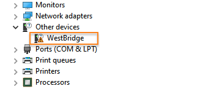
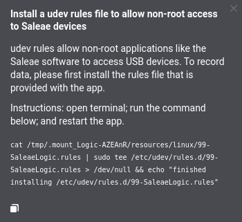

# Driver Install

Normally, when the Logic software is installed, the product should simply work when connected to the PC. In other cases, such as when using the standalone version of the software, the drivers must be installed manually.

### Prerequisites

#### Using Logic 4, Logic 8, Pro 8, or Pro 16?

If you are using any of the 2nd generation products \(Logic 4, Logic 8, Pro 8, Pro 16\), you must use the latest version Logic 1.x software below.



#### Using Original Logic or Logic16?

If you have manually installed the 1st generation Logic or Logic16 drivers in the past, you will need to update to the latest software and then manually install the correct driver again.

#### Device Shows up as _WestBridge_ or _unidentified device_

In Windows, the Saleae Logic may show up as a _WestBridge_ or _unidentified_ device in device manager. If this is the case, then there is a problem with the Saleae driver. Please install the driver per the methods listed in this support article.

If the drivers are installed properly, you should see _Saleae Logic X USB Logic Analyzer_ in Device Manager, where "X" is the specific product version \(4, 8, Pro 8, Pro 16\).

## Windows Instructions

### Method 1: New Hardware Wizard Installation

We want to get to the new-hardware wizard for Logic. Please connect Logic and then open the Device Manager.

* In Windows 10 and 8.1, you can right-click on the Windows logo in the lower left and select Device Manager.
* In Windows 8.0, you can search for the Device Manager from the Start screen.
* In Windows 7 and Vista, you need to open the Control Panel, select System, and then click the link for Device Manager on the left.
* In Windows XP,  you will need to open the Control Panel, open System, go to the Hardware tab, and click the button for Device Manager.

In Device Manager, I'm guessing that Logic will show up right away as an unknown device with a warning icon next to it. Right-click this and select Update Driver.

Select the second option for "Browse my computer for driver software."

Use the Browse button to direct the driver wizard to the Drivers folder, which is located where the Logic software was installed. Make sure the "Include Subfolders" checkbox is checked.

* If the Logic software is already installed, the Drivers folder is here: C:\Program Files\Saleae LLC\Drivers
* Otherwise, if using the standalone software, the Drivers folder is here:

  \Drivers\Windows

Click Next. If this fails, continue below.

### Method 2: "Have-Disk" Manual Installation


Before continuing, please make sure you have the latest Logic software version installed. If you are using an older version, such as 1.1.15, the below steps will create additional problems. Please contact support if you are unsure if you have the correct software installed.


Open the Device Manager. Right-click the Logic device and select Update Driver. Click "Browse my computer for driver software."

Click "Let me pick from a list of device drivers on my computer."

Next, it will ask you for the device type. Select "Universal Serial Bus Controllers."

This option is only present if no existing driver is installed. If a driver is already installed, this step will be skipped.

Now you will be presented with a window you may remember from installing printer drivers on Windows 95. Click the "Have Disk..." button.

This will open the install from the disk window, which will assume that you have inserted a floppy disk into drive A with the drivers. Click browse, navigate to the extracted drivers folder, and select Saleae.inf.

At this point, you should see either just the device you have connected or both Logic and Logic16. See below for details before selecting the device you are using.

If the checkbox for "Show compatible hardware" is checked, only 1 device should be shown. If it is not the correct device, then uncheck it to see all available Saleae drivers, as shown below.

These are all of the drivers that are included with the latest beta software, which you should see in the list when the checkbox for "Show compatible hardware" is not selected.

Saleae Logic 4 USB Logic Analyzer  
Saleae Logic 8 USB Logic Analyzer  
Saleae Logic Pro 16 USB Logic Analyzer  
Saleae Logic Pro 8 USB Logic Analyzer  
Saleae Logic Start USB Logic Analyzer  
Saleae Logic USB Logic Analyzer  
Saleae Logic 16 USB Logic Analyzer


It's VERY important to select the correct product. Selecting the wrong product will cause our software to download the wrong firmware image, causing undefined behavior.


There is some naming confusion here that I would like to clear up.

If you purchased the Logic 4, the Logic Pro 8, or the Logic Pro 16, please select the driver that matches the product name.

If you purchased the new Logic 8, our logic 8 channel logic analyzer with digital and analog, released in September 2014, please use the driver "Saleae Logic 8 USB Logic Analyzer" and NOT the driver "Saleae Logic USB Logic Analyzer." If you have the original Logic unit, 8 channel, digital only, discontinued in mid-2014, please select "Saleae Logic USB Logic Analyzer" and not the one with the number 8.

The original Logic 16, also discontinued in 2014, uses the "Saleae Logic 16 USB Logic Analyzer" driver and NOT the pro version.

### Method 3: Uninstall and Reinstall Existing Logic Driver

When connecting Logic to the USB port and starting the Logic software, the Device Manager may show the device as "Logic Pro." This is incorrect, and may cause issues with operation. The solution is to uninstall and reinstall the Logic driver on the PC.

Solution steps if the device incorrectly appears as "Logic Pro" under Device Manager: 

1. Close Logic software, but keep the Logic device connected to the PC
2. Open Device Manager
3. Right click "Logic Pro" in the Device Manager
4. Click "Uninstall device"
5. A window will popup indicating that you are about the uninstall the device from your system
6. Select the checkbox that says "Delete the driver software for this device"
7. Click "Uninstall"
8. Unplug and replug the Logic analyzer
9. Open the Logic Software. The Logic device should now connect to the Logic software.

### Contacting Us for Further Support

If at the end of this process you still get an error, please [contact support](https://contact.saleae.com/hc/en-us/requests/new) and include the following information:

* What OS and OS version you are using and if it is 32-bit or 64-bit.
* If the device has worked on this PC before.
* If the device has worked on other PCs before.
* Any information that may have been displayed when the drivers failed to install.
* How does the device show up under Device Manager?
* The driver install logs locations are described below.
  * On XP, these are located here: 
    * C:\Windows\setupapi.log
  * On newer versions of Windows, it should be here: 
    * C:\WINDOWS\INF\setupapi.dev.log

## Linux Ubuntu Instructions

When the Logic 2 software is opened, a udev rule file is checked. If the udev rule is missing, then an error message will popup to prompt you to install the proper udev rule file. Follow the instructions to open the terminal and run the command to install the udev file.

Instructions: 

1. Open terminal
2. Run the command below
3. Restart the app

`cat /tmp/.mount_Logic-AZEAnR/resources/linux/99-SaleaeLogic.rules | sudo tee /etc/udev/rules.d/99-SaleaeLogic.rules > /dev/null && echo "finished installing /etc/udev/rules.d/99-SaleaeLogic.rules"`

