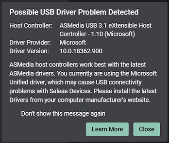

# Warning Message: Possible USB Driver Problem Detected

The Logic 2.x software may generate the following warning message if it detects a USB driver issue.

If you are unsure which driver you need or would like to verify that you are downloading the correct driver, feel free to collect the information about your host controller and contact [Saleae support](https://contact.saleae.com/hc/en-us/requests/new). Below are the latest driver versions and download links for each host controller.

## Latest USB 3.0 Host Controller Drivers

### Windows 10 & Windows 8.1/8

Windows 10 & Windows 8.1/8 use a new Microsoft-created USB 3.0 driver that supports all USB 3.0 host controllers. This driver works extremely well, and it is the recommended driver for all USB 3.0 host controllers with the exception of the following host controllers

* **ASMedia USB 3.0 or 3.1 Host Controller**
  * Source: From card or motherboard vendor
  * [Driver Download Link](https://www.asus.com/Motherboard-Accessories/USB_31_TYPEA_CARD/HelpDesk_Download/)
  * Note: All ASMedia devices \(3.0 or 3.1\) use the same driver
* **VIA USB Host Controller**
  * Source: Direct \(Via\)
  * [Driver Download Link](http://www.via-labs.com/driver.php)
  * Note: Only drivers older than version 4.90A have issues

For other host controllers, there is no need to perform any kind of driver update when you are on one of these releases of Windows.

### OS X

USB 3.0 host controller drivers are part of the OS X operating system and are not updated separately. Updates to different parts of the USB stack are frequently included in Apple updates, so it is highly recommended that you keep your OS up to date and running the latest OS X release.

#### Note for OSX Bootcamp \(Windows\)

If you are running Windows on Apple hardware, be sure to update the bootcamp software to the latest version. Specifically, make sure you are running bootcamp 5 or newer. If you are running Windows 7, after you have bootcamp 5+ installed, please verify that you can locate the Intel USB 3.0 host controller in the device manager list under "Universal Serial Bus Controllers." If you can not locate that device, there may have been an issue installing the bootcamp drivers. In that case, you can try to manually install the USB 3.0 drivers by downloading the bootcamp zip file from Apple, extracting it, and locating the Intel USB 3.0 driver installer below:

`BootCamp5.1.5621/BootCamp/Drivers/Intel/IntelxHCISetup.exe`

Run that application and reboot your computer to install the Intel USB 3.0 host controller drivers.

### Linux

On Linux, all USB 3.0 host controllers use the xhci\_hcd kernel module, which cannot be updated separately from the Linux kernel. In general, we recommend using kernel 3.4 or later \(Ubuntu 14.04.1 or newer\). Although the products do work on older kernels, we do not officially support those use cases.

If you have trouble with the devices connecting or capturing on Linux, please be sure to contact support and include information about your kernel version and installed host controllers. Specifically, please provide the output of:

* `uname -r`
* `lspci -k`
* `lsusb`

Note: `lsusb` must be run when the Saleae Logic device is connected.

## Information for Logic 1.x

In our older Logic 1.x software, you can identify which USB 3.0 host controller\(s\) is installed on your system. Most machines will have a single USB 3.0 host controller and two USB 2.0 host controllers. To find the installed host controller\(s\), please follow the instructions below.



## Unsupported Operating Systems

### Windows 7 and Older


Microsoft support for Windows 7 ended on January 14, 2020


Most common problems with Logic Pro 8 and Logic Pro 16 on Windows 7 can be solved by simply updating the USB 3.0 host controller drivers manually.

These driver links should only be used if you are using Windows 7. Not all drivers are available directly from the host controller vendor and are instead distributed by the PCI express card or motherboard vendor that integrated that host controller. In most cases, it is just fine to use a driver download from a different website than the one that sold you the card, as long as it uses the same host controller. It is also okay to download the driver directly from the company where you purchased the card. In that case, please verify that the driver version is the same or newer than the one mentioned below. We recommend that you use drivers available directly from the host controller manufacturer.

* **Host: Renesas/NEC**  Source: From card or motherboard vendor  Version: 2.1.36.0  Link: [https://www.rosewill.com/rosewill-rc-505-2-port-usb-3-0-pci-express-card.html\#product\_tabs\_Downloads](https://www.rosewill.com/rosewill-rc-505-2-port-usb-3-0-pci-express-card.html#product_tabs_Downloads)
* **Host: Intel 7 series**  Source: Direct \(Intel\)  Version: 1.0.10.255  Link: [https://downloadcenter.intel.com/download/21129/USB-3-0-Driver-Intel-USB-3-0-eXtensible-Host-Controller-Driver-for-Intel-7-Series-C216-Chipset-Family](https://downloadcenter.intel.com/download/21129/USB-3-0-Driver-Intel-USB-3-0-eXtensible-Host-Controller-Driver-for-Intel-7-Series-C216-Chipset-Family)
* **Host: Intel 8, 9, 100 series**  Source: Direct \(Intel\)  Version: 4.0.0.36  Link: [https://downloadcenter.intel.com/download/22824/USB-3-0-Driver-Intel-USB-3-0-eXtensible-Host-Controller-Driver-for-Intel-8-9-100-Series-and-C220-C610-Chipset-Family](https://downloadcenter.intel.com/download/22824/USB-3-0-Driver-Intel-USB-3-0-eXtensible-Host-Controller-Driver-for-Intel-8-9-100-Series-and-C220-C610-Chipset-Family)
* **Host: ASMedia 3.0 or 3.1**  Source: From card or motherboard vendor  Version: 1.16.23.0  Link: [https://www.asus.com/Motherboard-Accessories/USB\_31\_TYPEA\_CARD/HelpDesk\_Download/](https://www.asus.com/Motherboard-Accessories/USB_31_TYPEA_CARD/HelpDesk_Download/) Note: All ASMedia devices \(3.0 and 3.1\) use the same driver
* **Host: ETRON**  Source: Direct \(Etron\)  Version: 1.0.0.118  Link: [http://www.etron.com/en/products/u3hc\_detial.php?Product\_ID=6](http://www.etron.com/en/products/u3hc_detial.php?Product_ID=6)  Note: Click link in navigation for "Driver Download." Used for all models/revisions
* **Host: Texas Instruments**  Source: Direct \(Ti\)  Version: 1.16.5  Link: [http://www.ti.com/product/TUSB7340/toolssoftware](http://www.ti.com/product/TUSB7340/toolssoftware)  Note: TUSB73x0 xHCI Driver for WinXP/Vista/7 \(Rev. J\)
* **Host: VIA**  Source: Direct \(Via\)  Version: 4.90 A \(6.1.7600.4903\)  Link: [http://www.via-labs.com/driver.php](http://www.via-labs.com/driver.php)  Note: WHQL Driver for VL800/801 & 805/806 USB 3.0 Host Controller. Compatible with Windows XP/Vista/7/8 32-bit and 64-bit.
* **Host: Fresco Logic**  Source: Direct \(Fresco Logic\)  Version: 3.6.8.0  Link: [http://www.frescologic.com/support.php](http://www.frescologic.com/support.php)  Note: USB3.0 Host Driver HostDriver\_V3.6.8.0

\*\*\*\*

