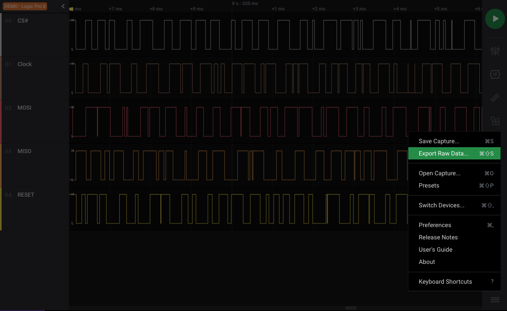
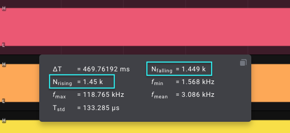

# Exporting Data to CSV is Slow

When exporting raw data as shown below, the process may be slow for very dense digital data. Our Logic 2 software keeps track of every digital transition in your data and, when exported to a CSV file, generates a new row for each transition. 

This performance issue is especially noticeable for digital captures that contain millions of digital transitions.

### Workarounds

We plan to improve the performance of our software, but in the meantime, here are some workarounds.

1. Export only a section of the data
2. Export only a few channels
3. Export to binary rather than CSV. We also have a sample python script to read binary data \(provided in the link below, at the bottom of the article\).



### How Many Digital Transitions are in my Captured Data?

Since export performance is related to how many digital transitions occur in your data, you can check this by using our built-in Clock Stats measurement extension. Install the extension \(it should be installed by default\) and SHIFT+drag across your entire range of digital data to count the number of rising edges and falling edges in your capture.

